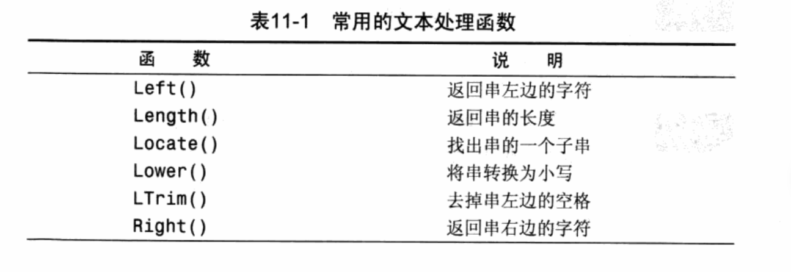
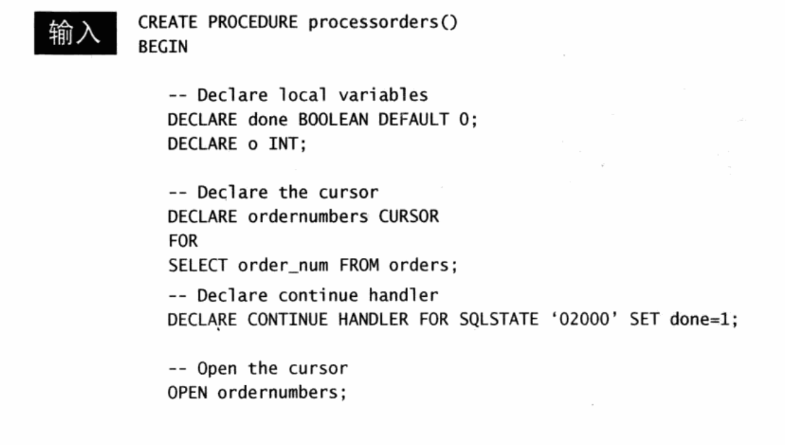
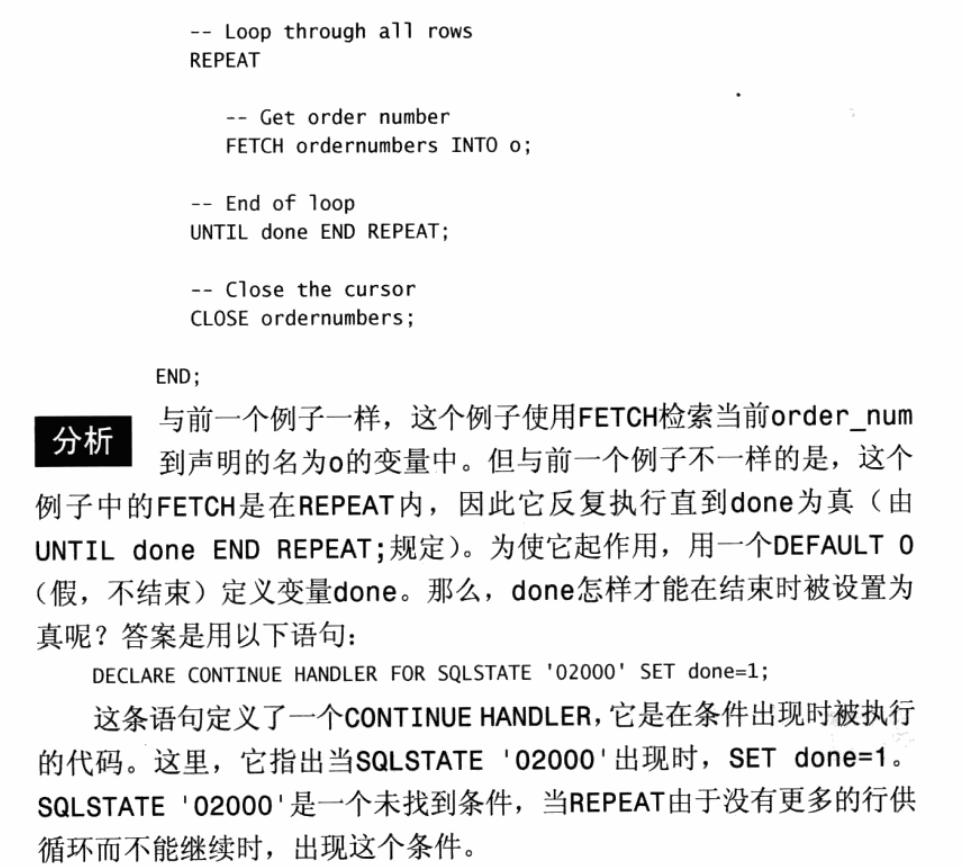

# MySQL必知必会读书笔记

数据集：http://forta.com/books/0672327120

## 1 了解SQL  

### 1.1 数据库基础  

#### 1.1.1 什么是数据库  

数据库 (database) 保存有组织的数据的容器（通常是一个文件或一组文件)。  

#### 1.1.2 表  

表（table) 某种特萣类型数据的结构化清单。  

模式（schema) 关于数据库和表的布局及特性的信息  

描述表的这组信息就是所谓的模式， 模式可以用来描述数据库中特定的表以及整个数据库（和其中表的关系）。  

#### 1.1.3 列和数据类型  

列 （column) 表中的一个字段。 所有表都是由一个或多个列组成的  

#### 1.1.4 行  

#### 1.1.5 主 键  

主 键 ( primary key) 一列（或一组列)， 其值能够唯一区分表中每个行。  

表中的任何列都可以作为主键， 只要它满足以下条件：
□ 任意两行都不具有相同的主键值；
□ 每个行都必须具有一个主键值（ 主键列不允许NULL值)。  

### 1.2 什么是SQL

SQL(发音为字母S-Q-L或sequel)是结构化査询语言( Structured Queiy
Language) 的缩写 。

## 2 MySQL简介 

### 2 .1 什么是MySQL

#### 2.1.1 客户机-服务器软件  

DBMS可分为两类： 一类为基于共享文件系统的DBMS, 另一类为基
于客户机-服务器的DBMS。 前者（包括诸如Microsoft Access和FileMaker)  用于桌面用途， 通常不用于髙端或更关键的应用。

### 2.2 MySQL工具  

#### 2.2.1 mysql命令行实用程序  

* 命令输入在mysql>之后；

* 命令用;或\9结束， 换句话说， 仅按Enter不执行命令；  

* 输入 help或\h 获得特定命令的帮助，如help select
* quit/exit退出

#### 2.2.2 MySQL Administrator  

MySQL Administrator ( MySQL管理器） 是一个图形交互客户机， 用
来简化MySQL服务器的管理。  

#### 2.2.3 MySQL Query Browse

MySQL Query Browser为一个图形交互客户机， 用来编写和执行MySQL命令  

## 3 使用MySQL

### 3.1 连 接  

### 3.2 选择数据库

使用use关键字

```mysql
mysql> use mysql
Reading table information for completion of table and column names
You can turn off this feature to get a quicker startup with -A

Database changed
```

### 3.3 了解数据库和表  

SHOW DATABASES;

```mysql
mysql> SHOW DATABASES;
+--------------------+
| Database           |
+--------------------+
| information_schema |
| mysql              |
| performance_schema |
| sys                |
+--------------------+
4 rows in set (0.00 sec)
```

SHOW TABLES;

```mysql
mysql> SHOW TABLES;
+------------------------------------------------------+
| Tables_in_mysql                                      |
+------------------------------------------------------+
| columns_priv                                         |
| component                                            |
| db                                                   |
| default_roles                                        |
| 。。。。                                              |
+------------------------------------------------------+
37 rows in set (0.00 sec)

```

SHOW也可以用来显示表列:  

SHOW COLUMNS FROM component;

```mysql
mysql> SHOW COLUMNS FROM component;
+--------------------+--------------+------+-----+---------+----------------+
| Field              | Type         | Null | Key | Default | Extra          |
+--------------------+--------------+------+-----+---------+----------------+
| component_id       | int unsigned | NO   | PRI | NULL    | auto_increment |
| component_group_id | int unsigned | NO   |     | NULL    |                |
| component_urn      | text         | NO   |     | NULL    |                |
+--------------------+--------------+------+-----+---------+----------------+
3 rows in set (0.00 sec)
```

所支持的其他SHOW语句还有:
□ SHOW STATUS, 用于显示广泛的服务器状态信息；
□ SHOW CREATE DATABASE和SHOW CREATE TABLE, 分别用来显
示创建特定数据库或表的MySQL语句；
□ SHOW GRANTS, 用来显示授予用户（所有用户或特定用户） 的安
全权限；
□ SHOW ERRORS和SHOW WARNINGS, 用来显示服务器错误或警告
消息。  

## 4 检 索 数 据 

### 4.1 SELECT语句  

### 4.2 检索单个列  

### 4.3 检索多个列  

### 4.4 检索所有列  

### 4.5 检索不同的行  

### 4.6 限 制 结 果  

为了返回第一行或前几行， 可使用LIMIT子句。  

### 4.7 使用完全限定的表名  

```mysql
SELECT products.prod_name
FROM products ;
```

表名也可以是完全限定的， 如下所示：

```mysql
SELECT products .prod_name
FROM crashcourse.products;
```

假定products表确实位于crashcourse数据库中  

## 5  排序检索数据  

### 5.1 排序数据  

使用 ORDER BY 子句

```mysql
SELECT prod—name
FROM products
ORDER BY prod_name ;
```

### 5.2 按多个列排序

```mysql
SELECT prod_idf prod—price, prod_name
FROM products
ORDER BY prod_price, prod_name:
```

仅在多个行具有相同的prod_price值时，才按prod_name进行排序  

### 5.3 指定排序方向  

默认升序，降序必须指定DESC关键字  

```mysql
SELECT procLid, prod_price, prod_name
FROM products
ORDER BY prod_price DESC:
```

多个列排序，DESC关键字只应用到直接位于其前面的列名。 在上例中， 只对prod_price列指定DESC， 对prodjiame列不指定。 因此，
prod_price列以降序排序， 而prodjiame列（ 在每个价格内） 仍然按标
准的升序排序  。

==在多个列上降序排序==

如果想在多个列上进行降序排序， 必须对每个列指定DESC关键字。

与DESC相反的关键字是ASC (ASCENDING), 在升序排序时可以指定
它。 但实际上， ASC没有多大用处， 因为升序是默认的（如果既不指定ASC也不指定DESC， 则假定为ASC)  。

==区分大小写和排序顺序==

在==字典( dictionary )排序顺序中， A被视为与a相同==， 这是MySQL( 和大多数数据库管理系统） 的默认行为。 但是， 许多数据库管理员能够在需要时改变这种行为（ 如果你的数据库包含大量外语字符， 可能必须这样做 。

## 6 过 滤 数 据  

### 6.1 使用WHERE子句  

只检索所需数据需要指定搜索条件（ search criteria ) , 搜索条件也称为过滤条件（ filter condition ) .

### 6.2 WHERE子句操作符  

<> 不等于

!= 不等于

= 等于

BETWEEN 在指定的两个值之间

####   6.2.4 空值检查  

使用IS NULL子句  

```mysql
SELECT FROM products prod_name
WHERE prod_price IS NULL;
```

## 7 数据过滤

### 7.1 组合WHERE子句  

AND OR

### 7.2 IN操作符  

IN取合法值的由逗号分隔的清单， 全都括在圆括号中。

```mysql
mysql> SELECT prod_name,prod_price
    -> FROM products
    -> WHERE vend_id IN (1002,1003)
    -> ORDER BY prod_name;
```

为什么要使用IN操作符？ 其优点具体如下。
□ 在使用长的合法选项清单时， IN操作符的语法更清楚且更直观。
□ 在使用IN时， 计算的次序更容易管理（因为使用的操作符更少)。
□ IN操作符一般比OR操作符清单执行更快。
□ IN的最大优点是可以包含其他SELECT语句,使得能够更动态地建
立WHERE子句。 第14章将对此进行详细介绍。  

### 7.3 NOT操作符  

NOT WHERE子句中用来否定后跟条件的关键字。  

## 8 用通配符进行过滤  

### 8.1 LIKE操作符  

**通配符（wildcard)**： 用来匹配值的一部分的特殊字符。  

**搜索模式 （ search pattern)®** ：由字面值、 通配符或两者组合构
成的搜索条件。  

LIKE是谓词而不是搮作符  

#### 8.1.1 百分号 (%) 通配符

最常使用的通配符是百分号 (%).在搜索串中， ％表示任何字符出现
任意次数。  

```mysql
SELECT prod_id , prod_name
FROM products
WHERE prod.nante LIKE 'jet5％’ ;
```

==搜索是区分大小写的==

注意尾空格  如 果 它 后 面 有 一 个 或 多 个 空 格， 則子句将不会匹配。

注意NULL 虽然似乎％ 配符可以匹配任何东西， 但有一个例外， 即NULL。   

#### 8.1.2 下划线(__)通配符  

下划线只匹H5单个字符而不是多个字符  

### 8.2 使用通配符的技巧  

在确实需要使用通配符时， 除非绝对有必要， 否则不要把它们用
在搜索模式的开始处。 把通配符置于搜索模式的幵始处， 搜索起
来是最慢的。 

## 9 用正则表达式进行搜索 

### 9.2.1 基本字符匹配  

REGEXP后所跟的东西作为正则表达式（ 与文字正文1000匹配的一个正则表&式） 处理 。

.是正则表达式语言中一个特殊的字符。 它表示匹配任意一个字符  

```mysql
SELECT prod_name
FROM products
WHERE prod
ORDER BY prod ^name_name REGEXP ;
```

LIKE匹配整个列。 如果被匹配的文本在列值中出现， LIKE将不会找到它， 相应的行也不被返回（ 除非使用 通 配 符 而REGEXP在列值内进行匹配， 如果被匹配的文本在列值中出现， REGEXP将会找到它， 相应的行将被返回.这是一个非常重要的差别  

==匹配不区分大小写==

### 9.2.2 进行OR匹配

为搜索两个串之一 （或者为这个串，或者为另一个串），使用丨，如下：

```mysql
SELECT prod—name
FROM products
WHERE prod_name REGEXP '1000|2000|3000 *
ORDER BY prod_name
```

### 9.2.3 匹配几个字符之一  

匹配任何单一字符。 只匹配特定的字符，可通过指定一组用[ 和]括起来的字符来完成。

```mysql
SELECT FROM products prod_name
WHERE prod.name REGEXP '[123] Ton'/REGEXP '1|2|3 Ton'
ORDER BY prod_name;
```

它的意思是匹配1或2或3 ,事实上， 正则表达式 [ 123】 Ton
为 [ 1 | 2 | 3 ]Ton的缩写， 也可以使用后者。  

### 9.2.4 匹配范围  

[0123456789]
为简化这种类型的集合， 可使用-来定义一个范围。 下面的式子功能
上等同于上述数字列表：
[0-9]  

此外， 范围不一定只是数值的， [ a- z 】 匹配任意字母字符。   

### 9.2.5 匹配特殊字符  

我们己经看到_ 、[ ] 、|和-等， 还有其他一些字符。 请问， 如果你需要匹配这些字符， 应该怎么办呢？ 例如， 如果要找出包含.字符的值， 怎样搜索？  

为了匹配特殊字符， 必须用\ \ 为前导。  \ \\- 表示査找 -   


匹配\ :为了匹配反斜杠（ \ ) 字符本身， 需要使用 \\ \ \.

\或 \ \?: 多数正则表达式实现使用单个反斜杠转义特殊字符， 以便能使用这些字符本身。 但MySQL要求两个反斜杠( MySQL自己解释一个， 正则表达式库解释另一个).

### 9.2.6 匹配字符类  

存在找出你自己经常使用的数字、 所有字母字符或所有数字字母字
符等的匹配。 为更方便工作， 可以使用预定义的字符集， 称为字符类
( character class)。 表9-2列出字符类以及它们的含义。  


### 9.2.7 匹配多个实例  

有时需要对匹配的数目进行更强的控制。 例如， 你可能需要寻找所有的数， 不管数中包含多少数字， 或者你可能想寻找一个单词并且还能够适应一个尾 随的s (如果存在)， 等等 。

这可以用表9-3列出的正则表达式重复元字符来完成 。


举几个例子 

```mysql
mysql> SELECT prod_name
    -> FROM products
    -> WHERE prod_name REGEXP '\\([0-9] sticks?\\)'
    -> ORDER BY prod_name;
+----------------+
| prod_name      |
+----------------+
| TNT (1 stick)  |
| TNT (5 sticks) |
+----------------+
2 rows in set (0.01 sec)
```

正则表达式`\ \([0\- 9 ] StickS?\ \)`需要解说一下。 `\ \`(匹配） ，[ 0-9] 匹配任意数字（ 这个例子中为1和5 )， sticks?匹配stick和sticks (s后的?使s可选，因为？匹配它前面的任何字符的0次或1次出现）， \ \ ) 匹配） 。 没有？， 匹配stick和sticks会非常困难。 

```mysql
mysql> SELECT prod_name FROM products WHERE prod_name REGEXP '[[:digit:]]{4}' ORDER BY prod_name;
+--------------+
| prod_name    |
+--------------+
| JetPack 1000 |
| JetPack 2000 |
+--------------+
2 rows in set (0.00 sec)

```

[[:digit:]]{4}匹配连在一起的任意4位数字 

###  9.2.8 定位符

目前为止的所有例子都是匹配一个串中任意位置的文本。  为了匹配特定位置的文本， 需要使用表9-4列出的定位符。  


```mysql
where prod_name REGEXP '^[0-9\\.]'
```

^匹配串的开始。 因此， '^[0-9\\.]'只在.或任意数字为串中第
一个字符时才匹配它们。  

## 10 创建计算字段  

### 10.1 计算字段

存储在数据库表中的数据一般不是应用程序所需要的格式。 

我们需要直接从数据库中检索出转换、 计算或格式化过的数据； 而不是检索出数据， 然后再在客户机应用程序或报告程序中重新格式化 。

计算字段并不实际存在于数据库表中。 计算字段是运行时在SELECT语句内创建的。  

==字段 (field)==： 基本上与列（ column ) 的意思相同， 经常互换使
用， 不过数据库列一般称为列， 而术语字段通常用在计算字段的
连接上。  

### 10.2 拼接字段  

拼接（concatenate)： 将值联结到一起构成单个值。  

MySQL的不同之处多数DBMS使用 +或丨 |来实现拼接，
MySQL則使用==Concat( )==函数来实现。


Concat( )拼接串， 即把多个串连接起来形成一个较长的串 .

通过删除数据右侧多余的空格来整理数据， 这可以使用MySQL的RT rim( )函数来完成 。


使用别名  AS

### 10.3 执行算术计算 

+-*/

## 11 使用数据处理函数  

### 11.1 函数  

### 11.2 使用函数  

大多数SQL实现支持以下类型的函数。
□ 用于处理文本串（ 如删除或填充值， 转换值为大写或小写） 的文本函数。
□ 用于在数值数据上进行算术操作（ 如返回绝对值， 进行代数运算）
的数值函数，
□ 用于处理日期和时间值并从这些值中提取特定成分（ 例如， 返回
两个日期之差， 检查日期有效性等） 的日期和时间函数。
□ 返回DBMS正使用的特殊信息（ 如返回用户登录信息， 检查版本
细节） 的系统函数    

#### 11.2.1 文本处理函数  

Upper( )将文本转换为大写  



SOUNDEX是一个将任何文本串转换为描述其语音表示的字母数字模式的算法。SOUNDEX考虑了类似的发音字符和音节， 使得能对串进行发音比较而不是字母比较。 虽然SOUNDEX不是SQL概念。

使用Soundex0函数进行搜索， 它匹配所有发音类似于
Y.Lie的联系名。

```mysql
mysql> SELECT cust_name,cust_contact FROM customers WHERE Soundex(cust_contact)=Soundex('Y Lie');
+-------------+--------------+
| cust_name   | cust_contact |
+-------------+--------------+
| Coyote Inc. | Y Lee        |
+-------------+--------------+
1 row in set (0.00 sec)
```

### 11.2.2 日期和时间处理函数  


```mysql
SELECT cust_id p order_num
FROM orders
WHERE Date(order_date) = '2005-09-01';
```

如果要的是日期 则使用Date( )是一个良好的习惯.

### 11.2.3 数值处理函数  


## 12 汇总数据

###   12.1 聚集函数  


### 12.2 聚集不同值  

指定DISTINCT参数

AVG(DISTINCT prod_price)

## 13 分组数据

### 13.1 数据分组  

### 13.2 创建分组  

GROUP BY子句  

HAVING子句  

HAVING和WHERE的差别这里有另一种理解方法， WHERE在数据分组前进行过滤， HAVING在数据分组后进行过滤。 这是一个重要的区别， WHERE排除的行不包括在分组中。 这可能会改变计算值， 从而影响HAVING子句中基于这些值过滤掉的分组。

### 13.4 分组和排序  

虽然GROUP BY和ORDER BY经常完成相同的工作， 但它们是非常不
同的 .


## 14 使用子查询

### 14.1 子查询  

SQL还允许创建子查询（ subquery ) , 即嵌套在其他查询中的查询  

### 14.2 利用子查询进行过滤  

```mysql
SELECT cust_id
FROM orders
WHERE order_num IN (SELECT order_num
FROM orderitems
WHERE prod_id='TNT2');
```

格式化SQL 包含子查询的SELECT语句难以阅读和调试,特别是它们较为复杂时更是如此。 如上所示把子查询分解为多行并且适当地进行缩进， 能极大地简化子查询的使用。

### 14.3 作为计算字段使用子查询  

```mysql
mysql> SELECT cust_name,cust_state,
    -> (SELECT COUNT(*)
    -> FROM orders
    -> WHERE orders.cust_id=customers.cust_id) AS orders
    -> FROM customers
    -> ORDER BY cust_name;
+----------------+------------+--------+
| cust_name      | cust_state | orders |
+----------------+------------+--------+
| Coyote Inc.    | MI         |      2 |
| E Fudd         | IL         |      1 |
| Mouse House    | OH         |      0 |
| Wascals        | IN         |      1 |
| Yosemite Place | AZ         |      1 |
+----------------+------------+--------+
5 rows in set (0.01 sec)

```

相关子查询 （ correlated subquery) : 涉及外部査询的子查询。  

## 15 联 结 表  

### 1 5 . 1 联 结  

#### 15.1.1 关系表

 外键 (foreign key) 外键为某个表中的一列， 它包含另一个表
的主键值， 定义了两个表之间的关系。  

#### 15.1.2 为什么要使用联结  

分解数据为多个表能更有效地存储， 更方便地处理， 并且具有更大的可伸缩性。 但这些好处是有代价的。如果数据存储在多个表中， 怎样用单条SELECT语句检索出数据？答案是使用联结。

### 15.2 创建联结  

```mysql
WHERE vendors •vend_id = products . vend_id
```

两个表用WHERE子句正确联结， WHERE子句指示MySQL匹配vendors表中的vend_id和products表中的vend_id。

#### 15.2.1 WHERE子句的重要性  

笛卡儿积（cartesian product) ：由没有联结条件的表关系返回的结果为笛卡儿积。 检索出的行的数目将是第一个表中的行数乘以第二个表中的行数。

#### 15.2.2 内部联结  

目前为止所用的联结称为等值联结 (equijoin)  

```mysql
mysql> SELECT vend_name,prod_name,prod_price
    -> FROM vendors INNER JOIN products
    -> ON vendors.vend_id = products.vend_id;
+-------------+----------------+------------+
| vend_name   | prod_name      | prod_price |
+-------------+----------------+------------+
| Anvils R Us | .5 ton anvil   |       5.99 |
| Anvils R Us | 1 ton anvil    |       9.99 |
| Anvils R Us | 2 ton anvil    |      14.99 |
| LT Supplies | Fuses          |       3.42 |
| LT Supplies | Oil can        |       8.99 |
| ACME        | Detonator      |      13.00 |
| ACME        | Bird seed      |      10.00 |
| ACME        | Carrots        |       2.50 |
| ACME        | Safe           |      50.00 |
| ACME        | Sling          |       4.49 |
| ACME        | TNT (1 stick)  |       2.50 |
| ACME        | TNT (5 sticks) |      10.00 |
| Jet Set     | JetPack 1000   |      35.00 |
| Jet Set     | JetPack 2000   |      55.00 |
+-------------+----------------+------------+
14 rows in set (0.01 sec)
```

## 16  创建高级联结  

### 16.1 使用表别名  

### 16.2 使用不同类型的联结  

#### 16.2.1 自联结

假如你发现某物品（ 其ID为DTNTR)存在问题， 因此想知道生产该物
品的供应商生产的其他物品是否也存在这些问题。 此查询要求首先找到
生产ID为DTNTA的物品的供应商， 然后找出这个供应商生产的其他物品。
下面是解决此问题的一种方法：  

```mysql
SELECT prod_id, prod_name
FROM products
WHERE vend_id=(SELECT vend_id
FROM products
WHERE prod_id='DTNTR');
```

#### 16.2.2 自然联结  

标准的联结（ 前一章中介绍的内部联结） 返回所有数据， 甚至相同的列多次出现。 自然联结排除多次出现， 使每个列只返回一次 .

事实上， 迄今为止我们建立的每个内部联结都是自然联结 .

#### 16.2.3 外部联结  

在使用OUTER JOIN语法时， 必须使用RIGHT或LEFT
关键字指定包括其所有行的表（RIGHT指出的是OUTER JOIN右边的表，
而LEFT指出的是OUTER JOIN左边的表）  使用LEFT OUTER
JOIN从FROM子句的左边表（ customers表） 中选择所有行。  

## 17 组合查询

UNION操作符将多条SELECT语句组合成一个结果集。

### 17.1 组合查询  

### 17.2 创建组合查询  

#### 17.2.1 使用UNION  

举一个例子， 假如需要价格小于等于5的所有物品的一个列表， 而且
还想包括供应商1001和1002生产的所有物品（ 不考虑价格).当然， 可
以利用WHERE子句来完成此工作， 不过这次我们将使用UNION。
正如所述， 创建UNION涉及编写多条SELECT语句。  

```mysql
SELECT vend_id, prod_id, prod_price
FROM products
WHERE prod_price <= 5
UNION
SELECT vend_id, prod_idf prod_price
FRW products
WHERE vend_id IN (1001,1002);
```

使用UNION可能比使用WHERE子句更为复杂。但对于更复杂的过滤条件， 或者从多个表（ 而不是单个表） 中检索数据的情形， 使用UNION可能会使处理更简单 .

#### 17.2.2 UNION规则  

□ UNION必须由两条或两条以上的SELECT语句组成， 语句之间用关键字UNION分隔（因此， 如果组合4条SELECT语句， 将要使用3个UNION关键字）。
□ UNION中的每个査询必须包含相同的列、 表达式或聚集函数（ 不过各个列不需要以相同的次序列出）。
□ 列数据类型必须兼容： 类型不必完全相同， 但必须是DBMS可以隐含地转换的类型（例如， 不同的数值类型或不同的日期类型)。如果遵守了这些基本规则或限制， 则可以将并用于任何数据检索任务。

#### 17.2.3 包含或取消重复的行  

 UNION从査询结果集中==自动去除了重复的行==（换句话说， 它的行为与
单条SELECT语句中使用多个WHERE子句条件一样)。

这是UNION的默认行为， 但是如果需要， 可以改变它。 事实上， 如果
想返回所有匹配行， 可使用==UNION ALL==而不是UNION。  

#### 17.2.4 对组合查询结果排序  

只能使用一条ORDER BY子句， 它必须出现在最后一条SELECT语句之后,不允许使用多条ORDER BY子句 。

## 18 全文本搜索  

### 18.1 理解全文本搜索  

所有这些限制以及更多的限制都可以用全文本搜索来解决。 在使用全文本搜索时， MySQL不需要分别査看每个行， 不需要分别分析和处理每个词。 MySQL创建指定列中各词的一个索引， 搜索可以针对这些词进行。

### 18.2 使用全文本搜索  

为了进行全文本搜索， 必须索引被搜索的列， 而且要随着数据的改变不断地重新索引。 在对表列进行适当设计后， MySQL会自动进行所有的索引和重新索引。
在索引之后， SELECT可与Match 和Against( )—起使用以实际执行搜索 。

#### 18.2.1 启用全文本搜索支持  

一般在创建表时启用全文本搜索。 CREATE TABLE语句（ 第21章中介绍） 接受FULLTEXT子句， 它给出被索引列的一个逗号分隔的列表。

```mysql
CREATE TABLE productnotes
（
	note_id int NOT NULL AUTO_INCREMENT,
	prod_id char(10) NOT NULL,
	note_data datetime NOT NULL,
	note _text text NULL,
	PRIMARY KEY(note_id),
	FULLTEXT(note_text)
)ENCINE=MylSAM;
```

MySQL根据子句FULLTEXT< note_text)的指示对它进行索引。 这里的FULLTEXT索引单个列， 如果需要可以指定多个列 。

在定义之后， MySQL自动维护该索引。 在增加、 更新或删除行时，索引随之自动更新。
可以在创建表时指定FULLTEXT， 或者在稍后指定（ 在这种情况下所有已有数据必须立即索引）。  

#### 18.2.2 进行全文本搜索  

进行索引之后，就可以调用Match ( )和Against( )执行全文本搜索，其中Match()指定要搜索的列，Against（）指定要使用的搜索表达式。

```mysql
mysql> SELECT note_text
    -> FROM productnotes
    -> WHERE Match(note_text) Against('rabbit');
+----------------------------------------------------------------------------------------------------------------------+
| note_text                                                                                                            |
+----------------------------------------------------------------------------------------------------------------------+
| Customer complaint: rabbit has been able to detect trap, food apparently less effective now.                         |
| Quantity varies, sold by the sack load.
All guaranteed to be bright and orange, and suitable for use as rabbit bait. |
+----------------------------------------------------------------------------------------------------------------------+
2 rows in set (0.03 sec)

```

事实是刚才的搜索可以简单地用LIKE子句完成  

```mysql
mysql> SELECT note_text
    -> FROM productnotes
    -> WHERE note_text LIKE '%rabbit%';
+----------------------------------------------------------------------------------------------------------------------+
| note_text                                                                                                            |
+----------------------------------------------------------------------------------------------------------------------+
| Quantity varies, sold by the sack load.
All guaranteed to be bright and orange, and suitable for use as rabbit bait. |
| Customer complaint: rabbit has been able to detect trap, food apparently less effective now.                         |
+----------------------------------------------------------------------------------------------------------------------+
2 rows in set (0.01 sec)

```

上述两条SELECT语句都不包含ORDER BY子句。 后者（ 使用LIKE)以不特别有用的顺序返回数据。 前者（ 使用全文本搜索） 返回以文本匹配的良好程度排序的数据。 两个行都包含词rabbit， 但包含词rabbit作为第3个词的行的等级比作为第20个词的行高。这很重要。全文本搜索的一个重要部分就是对结果排序。 具有较高等级的行先返回。

为演示排序如何工作， 请看以下例子：  

```mysql
mysql> SELECT note_text, Match(note_text) Against('rabbit') as the_rank FRO
M productnotes;
+-----------------------------------------------------------------------------------------------------------------------------------------------------------+--------------------+
| note_text                                                                                                                                                 | the_rank           |
+-----------------------------------------------------------------------------------------------------------------------------------------------------------+--------------------+
| Customer complaint:
Sticks not individually wrapped, too easy to mistakenly detonate all at once.
Recommend individual wrapping.                          |                  0 |
| Can shipped full, refills not available.
Need to order new can if refill needed.                                                                          |                  0 |
| Safe is combination locked, combination not provided with safe.
This is rarely a problem as safes are typically blown up or dropped by customers.         |                  0 |
| Quantity varies, sold by the sack load.
All guaranteed to be bright and orange, and suitable for use as rabbit bait.                                      | 1.5905543565750122 |
| Included fuses are short and have been known to detonate too quickly for some customers.
Longer fuses are available (item FU1) and should be recommended. |                  0 |
| Matches not included, recommend purchase of matches or detonator (item DTNTR).                                                                            |                  0 |
| Please note that no returns will be accepted if safe opened using explosives.                                                                             |                  0 |
| Multiple customer returns, anvils failing to drop fast enough or falling backwards on purchaser. Recommend that customer considers using heavier anvils.  |                  0 |
| Item is extremely heavy. Designed for dropping, not recommended for use with slings, ropes, pulleys, or tightropes.                                       |                  0 |
| Customer complaint: rabbit has been able to detect trap, food apparently less effective now.                                                              | 1.6408053636550903 |
| Shipped unassembled, requires common tools (including oversized hammer).                                                                                  |                  0 |
| Customer complaint:
Circular hole in safe floor can apparently be easily cut with handsaw.                                                                |                  0 |
| Customer complaint:
Not heavy enough to generate flying stars around head of victim. If being purchased for dropping, recommend ANV02 or ANV03 instead.   |                  0 |
| Call from individual trapped in safe plummeting to the ground, suggests an escape hatch be added.
Comment forwarded to vendor.                            |                  0 |
+-----------------------------------------------------------------------------------------------------------------------------------------------------------+--------------------+
14 rows in set (0.00 sec)
```

这里， 在SELECT而不是WHERE子句中使用Match( )和Against0。
这使所有行都被返回（ 因为没有WHERE子句）。 Match( > 和
Against( >用来建立一个计算列（ 别名为 rank), 此列包含全文本搜索
计算出的等级值。 等级由MySQL根据行中词的数目、 唯一词的数目、 整
个索引中词的总数以及包含该词的行的数目计算出来。 正如所见， 不包
含词rabbit的行等级为0  。

#### 18.2.3 使用查询扩展 

`Against('anvils' WITH QUERY EXPANSION);`

 查询扩展用来设法放宽所返回的全文本搜索结果的范围。考虑下面的情况。 你想找出所有提到anvils的注释。只有一个注释包含词anvils，但你还想找出可能与你的搜索有关的所有其他行， 即使它们不包含词anvils。

这也是查询扩展的一项任务。 在使用查询扩展时， MySQL对数据和
索引进行两遍扫描来完成搜索：
□ 首先 ， 进行一个基本的全文本搜索， 找出与搜索条件匹配的所有
行;
□ 其次， MySQL==检查这些匹配行并选择所有有用的词==（ 我们将会简
要地解释MySQL如何断定什么有用， 什么无用X
□ 再其次， MySQL再次进行全文本搜索， ==这次不仅使用原来的条件，
而且还使用所有有用的词==。  

下面举一个例子， 首先进行一个简单的全文本搜索， 没有查询扩展 ：

```mysql
mysql> SELECT note_text
    -> FROM productnotes
    -> WHERE Match (note_text) Against('anvils');
+----------------------------------------------------------------------------------------------------------------------------------------------------------+
| note_text                                                                                                                                                |
+----------------------------------------------------------------------------------------------------------------------------------------------------------+
| Multiple customer returns, anvils failing to drop fast enough or falling backwards on purchaser. Recommend that customer considers using heavier anvils. |
+----------------------------------------------------------------------------------------------------------------------------------------------------------+
1 row in set (0.00 sec)
```

只有一行包含词anvils， 因此只返回一行。  

下面是相同的搜索， 这次使用查询扩展:  

```mysql
mysql> SELECT note_text
    -> FROM productnotes
    -> WHERE Match(note_text) Against('anvils' WITH QUERY EXPANSION);
+----------------------------------------------------------------------------------------------------------------------------------------------------------+
| note_text                                                                                                                                                |
+----------------------------------------------------------------------------------------------------------------------------------------------------------+
| Multiple customer returns, anvils failing to drop fast enough or falling backwards on purchaser. Recommend that customer considers using heavier anvils. |
| Customer complaint:
Sticks not individually wrapped, too easy to mistakenly detonate all at once.
Recommend individual wrapping.                         |
| Customer complaint:
Not heavy enough to generate flying stars around head of victim. If being purchased for dropping, recommend ANV02 or ANV03 instead.  |
| Please note that no returns will be accepted if safe opened using explosives.                                                                            |
| Customer complaint: rabbit has been able to detect trap, food apparently less effective now.                                                             |
| Customer complaint:
Circular hole in safe floor can apparently be easily cut with handsaw.                                                               |
| Matches not included, recommend purchase of matches or detonator (item DTNTR).                                                                           |
+----------------------------------------------------------------------------------------------------------------------------------------------------------+
7 rows in set (0.01 sec)

```

这次返回了7行。 第一行包含词anvils, 因此等级最高。 第二行与anvils无关， 但==因为它包含第一行中的两个词( customer和recommend ), 所以也被检索出来==。 第3行也包含这两个相同的词， 但它们在文本中的位置更靠后且分开得更远， 因此也包含这一行， 但等级为第三。 第三行确实也没有涉及anvils (按它们的产品名）。

#### 18.2.4 布尔文本搜索

MySQL支持全文本搜索的另外一种形式， 称为布尔方式（ boolean mode)。 以布尔方式， 可以提供关于如下内容的细节。

□ 要匹配的词；
□ 要排斥的词（如果某行包含这个词， 则不返回该行， 即使它包含其他指定的词也是如此)；
□ 排列提示（指定某些词比其他词更重要， 更重要的词等级更髙)；
□ 表达式分组；
□ 另外一些内容。  

即使没有定义FULLTEXT索引， 也可以使用它。 但这是一种非常缓慢的操作( 其性能将随着数据量的增加而降低 )。    

为演示==IN BOOLEAN MODE==的作用， 举一个简单的例子;  

```mysql
mysql> SELECT note_text
    -> FROM productnotes
    -> WHERE Match (note_text)Against('heavy' IN BOOLEAN MODE);
+---------------------------------------------------------------------------------------------------------------------------------------------------------+
| note_text                                                                                                                                               |
+---------------------------------------------------------------------------------------------------------------------------------------------------------+
| Item is extremely heavy. Designed for dropping, not recommended for use with slings, ropes, pulleys, or tightropes.                                     |
| Customer complaint:
Not heavy enough to generate flying stars around head of victim. If being purchased for dropping, recommend ANV02 or ANV03 instead. |
+---------------------------------------------------------------------------------------------------------------------------------------------------------+
2 rows in set (0.01 sec)

```

此全文本搜索检索包含词heavy的所有行（ 有两行)。 其中使用了关键字IN BOOLEAN MODE, 但实际上没有指定布尔操作符，因此， 其结果与没有指定布尔方式的结果相同。

为了匹配包含heavy但不包含任意以rope开始的词的行， 可使用以
下査询:  

```mysql
mysql> SELECT note_text 
    -> FROM productnotes
    -> WHERE Match(note_text) Against('heavy -rope*' IN BOOLEAN MODE);
+---------------------------------------------------------------------------------------------------------------------------------------------------------+
| note_text                                                                                                                                               |
+---------------------------------------------------------------------------------------------------------------------------------------------------------+
| Customer complaint:
Not heavy enough to generate flying stars around head of victim. If being purchased for dropping, recommend ANV02 or ANV03 instead. |
+---------------------------------------------------------------------------------------------------------------------------------------------------------+
1 row in set (0.00 sec)
```

这一次仍然匹配词heavy， 但- rope\*明确地指示MySQL 排除包含rope* (任何以rope开始的词) 的行。

表18-1列出支持的所有布尔操作符。  


下面举几个例子， 说明某些操作符如何使用:  

`Match(note — text) Against('+rabbit +bait' IN BOOLEAN MODE)`

这个搜索匹配==都包含==词rabbit和bait的行  

`WHERE Match(note_text) AgainstC * rabbit bait’ IN BOOLEAN MODE);  `

没有指定操作符， 这个搜索匹配包含rabbit和bait中的==至少一个词==的行。  

`Match(note_text) Againstrabbit bait"' IN BOOLEAN MODE):  `

这个搜索匹配短语rabbit bait而不是匹配两个词rabbit和bait.

`WHERE Match(note_text) Against(’>rabbit <carrot' IN BOOLEAN MODE);  `

匹配rabbit和carrot， 增加前者的等级， 降低后者的等级。  这样的话rabbit在排序中分量更重，只出现rabbit的比只出现carrot的等级更高，排在更前面，具体的等级排序要根据计算决定。

#### 18.2.5 全文本搜索的使用说明  

在结束本章之前， 给出关于全文本搜索的某些重要的说明。
□ 在索引全文本数据时， 短词被忽略且从索引中排除。 短词定义那些具有3个或3个以下字符的词(如果需要， 这个数目可以改)。
□ MySQL带有一个内建的非用词（ stopword) 列表， 这些词在索引全文本数据时总是被忽略。 如果需要， 可以覆盖这个列表（ 请参阅MySQL文档以了解如何完成此工作)。
□ 许多词出现的频率很髙， 搜索它们没有用处（返回太多的结果)。因此， MySQL规定了一条50%规则， 如果一个词出现在50%以上的行中， 则将它作为一个非用词忽略。 50%规则不用于IN BOOLEAN MODE。
□ 如果表中的行数少于3行， 则全文本搜索不返回结果（因为每个词或者不出现， 或者至少出现在50%的行中）。
□ 忽略词中的单引号。 例如， dorTt索引为dont。
□ 不具有词分隔符（包括日语和汉语） 的语言不能恰当地返回全文本搜索结果。
□ 如前所述， 仅在MylSAM数据库引擎中支持全文本搜索。

innodb不支持FULLTEXT类型的全文索引，但是innodb可以使用sphinx插件支持全文索引，并且效果更好。

## 19 插入数据

### 19.2 插入完整的行  

```mysql
INSERT INTO Customers
VALUES(NULL,
'Pep E. LaPew',
'100 Main Street',
'Los Angeles',
'CA',
'90046',
'USA',
NULL,
NULL):
```

虽然这种语法很简单， 但并不安全， 应该尽量避免使用。 上面的SQL语句高度依赖于表中列的定义次序， 并且还依赖于其次序容易获得的信息。 即使可得到这种次序信息， 也不能保证下一次表结构变动后各个列保持完全相同的次序。 因此， 编写依赖于特定列次序的SQL语句是很不安全的。 如果这样做， 有时难免会出问题。

编写INSERT语句的更安全（ 不过更烦琐） 的方法如下：  

```mysql
INSERT INTO customers(cust_name,
cust_address,
cust_city,
cust_state,
cust_zip,
cust_country,
cust_contact,
cust_emai1)
VALUES('Pep E. LaPew',
'100 Main Street',
'Los Angeles',
'CA',
'90046',
'USA',
NULL,
NULL):
```

此例子完成与前一个INSERT语句完全相同的工作， 但在表名后
的括号里明确地给出了列名。 在插入行时， MySQL将用VALUES
列表中的相应值填入列表中的对应项。 VALUES中的第一个值对应于第一个指定的列名。 第二个值对应于第二个列名， 如此等等.

因为提供了列名， VALUES必须以其指定的次序匹配指定的列名， 不一定按各个列出现在实际表中的次序。 其优点是， 即使表的结构改变，INSERT语句仍然能正确工作。 你会发现CUSt_id的NULL值 是 不 必 要 ，cust_id列并没有出现在列表中， 所以不需任何值。

如果对表中不允许NULL值且没有默认值的列不给出值， 则MySQL将产生一条错误消息， 并且相应的行插入不成功。

**提高整体性能** ：数据库经常被多个客户访问， 对处理什么请求以及用什么次序处理进行管理是MySQL的任务， INSERT操作可能很耗时（ 特别是有很多索引需要更新时 )， 而且它可能降低等待处理的SELECT语句的性能，如果数据检索是最重要的（ 通常是这样）， 则你可以通过在INSERT 和 INTO之 间 添 加 关 键 字 LOW_PRIORITY ， 指 示MySQL降低INSERT语句的优先级， 如下所示：
==INSERT LOW_PRIORXTY INTO==

顺便说一下， 这也适用于下一章介绍的UPDATE和DELETE语句。  

### 19.3 插入多个行  

使用多条INSERT语句， 甚至一次提交它们， 每条语句用一个==分号==结束， 如下所示：


或者， 只要每条INSERT语句中的列名（ 和次序） 相同， 可以如下组
合各语句：  

```mysql
INSERT INTO customers(cust_name,
cust_address,
cust_city,
cust_state,
cust_zip,
cust_country,
cust_contact,
cust_emai1)
VALUES('Pep E. LaPew',
'100 Main Street',
'Los Angeles',
'CA',
'90046',
'USA',
NULL,
NULL)，
('Gep A. Pew',
'50 Main Street',
'Los Angeles',
'CA',
'93242',
'USA',
NULL,
NULL):

```

其中单条INSERT语句有多组值， 每组值用==一对圆括号括起来，
用逗号分隔==。  

MySQL 用单条 INSERT 语 句 处 理 多 个 插 入 比 使 用 多 条INSERT语句==快==。  

### 19.4 插入检索出的数据  

将一条SELECT语句的结果插入表中。 这就是所谓的INSERT SELECT， 顾名思义， 它是由一条INSERT语句和一条SELECT语句组成的。

假如你想从另一表中合并客户列表到你的customers表。 不需要每次读取一行， 然后再将它用INSERT插入， 可以如下进行：

```mysql
INSERT INTO customers(cust_name,
cust_address,
cust_city,
cust_state,
cust_zip,
cust_country,
cust_contact,
cust_emai1)
SELECT cust_name,
cust_address,
cust_city,
cust_state,
cust_zip,
cust_country,
cust_contact,
cust_emai1
FROM custnew;
```

## 20 更新删除数据

### 20.1 更新数据  

```mysql
UPDATE customers
SET cust_email = 'eliner@fudd.com'
WHERE cust_id = 10005；
```

UPDATE语句总是以要更新的表的名字开始 。

SET命令用来将新值赋给被更新的列。

 更新多个列的语法稍有不同：  

```mysql
UPDATE customers
SET cust_name = 'The Fudds',
	cust_email = 'eliner@fudd.com'
WHERE cust_id = 10005；
```

只需要使用单个SET命令， 每个“ 列=值” 对之间
用逗号分隔（最后一列之后不用逗号)。   

==IGNORE关键字== 如果用UPDATE语句更新多行， 并且在些行中的一行或多行时出一个现错误， 则整个UPDATE操作被取消（ 错误发生前更新的所有行被恢复到它们原来的值 )• 为即使是发生错误， 也继续进行更新， 可使用IGNORE关键字， 如下所示:UPDATE IGNORE customers*... 

### 20.2 删除数据  

```mysql
DELETE FROM customers
WHERE cust_id = 10006;
```

更快的删除: 如果想从表中==删除所有行==,不要使用DELETE,可使用 ==TRUNCATE TABLE==语句， 它完成相同的工作 , 但速度更快（ TRUNCATE实际是删除原来的表并重新创建一个表， 而不
是逐行删除表中的数据 )。

DELETE不删除表本身。

## 21 创建和操纵表

### 21.1 创建表 

```mysql
CREATE TABLE customers
(
  cust_id      int       NOT NULL AUTO_INCREMENT,
  cust_name    char(50)  NOT NULL ,
  cust_address char(50)  NULL ,
  cust_city    char(50)  NULL ,
  cust_state   char(5)   NULL ,
  cust_zip     char(10)  NULL ,
  cust_country char(50)  NULL ,
  cust_contact char(50)  NULL ,
  cust_email   char(255) NULL ,
  PRIMARY KEY (cust_id)
) ENGINE=InnoDB;
```

实际的表定义（所有列） 括在圆括号之中。 各列之间用逗号分隔。   

主键值必须唯一。  

订单号（order_num列） 和订单物品（ order_item列） 的
组合是唯一的， 从而适合作A主键， 其定义为：
PRIMARY KEY (order_num, order_item)  

每个表只允许一个AUTO_INCREMENT列， 而且它必须被索引（如,通过使它成为主键）。  

==覆盖AUTO_INCREMEMT ：==

你可以简单地在INSERT语句中指定一个值， 只要它是唯一的（ 至今尚未使用过） 即可，该值将被用来替代自动生成的值。 后续的增量将开始使用该手工插入的值。   

如何在使用AUTO_INGREMENT列时获得这个值呢？ 可 使用last_insert_id( )函数获得这个值， 如下所示

`SELECT last_insert_id( )`

此语句返回最后一个AUTO_INCREMENT值， 然后可以将它用于后续的MySQL语句。  

==默认值：==

`quantity int DEFAULT 1,`

### 21.2 更新表  

ALTER TABLE语句  

增加列：

```mysql
ALTER TABLE vendors
ADO vend_phone CHAR(20);
```

删除刚刚添加的列， 可以这样做 ：

```mysql
ALTER TABLE vendors
DROP COLUMN vend_phone;
```

ALTER TABLE的一种常见用途是定义外键。   下面是用来定义本书中的表所用的外键的代码：  

```mysql
ALTER TABLE orderitems ADD CONSTRAINT fk_orderitems_orders FOREIGN KEY (order_num) REFERENCES orders (order_num);

ALTER TABLE orderitems ADD CONSTRAINT fk_orderitems_products FOREIGN KEY (prod_id) REFERENCES products (prod_id);

ALTER TABLE orders ADD CONSTRAINT fk_orders_customers FOREIGN KEY (cust_id) REFERENCES customers (cust_id);

ALTER TABLE products ADD CONSTRAINT fk_products_vendors FOREIGN KEY (vend_id) REFERENCES vendors (vend_id);
```

### 21.3 删除表 

使用DROP TABLE语句即可

### 21.4 重命名表 

```mysql
RENAME TABLE backup_customers TO customers;
```

## 22 使用视图

### 22.1 视图

相当于临时表

#### 22.1.1 为什么使用视图  

□ 重用SQL语句。
□ 简化复杂的SQL操作。 在编写查询后， 可以方便地重用它而不必知道它的基本查询细节。
□ 使用表的组成部分而不是整个表。
□ 保护数据。 可以给用户授予表的特定部分的访问权限而不是整个表的访问权限。
□ 更改数据格式和表示。 视图可返回与底层表的表示和格式不同的数据。

#### 22.1.2 视图的规则和限制  

□ 与表一样， 视图必须唯一命名（ 不能给视图取与别的视图或表相同的名字)。
□ 对于可以创建的视图数目没有限制。
□ 为了创建视图， 必须具有足够的访问权限。 这些限制通常由数据库管理人员授予。
□ 视图可以嵌套， 即可以利用从其他视图中检索数据的查询来构造一个视图。
□ ORDER BY可以用在视图中， 但如果从该视图检索数据SELECT中也含有ORDER BY, 那么该视图中的ORDER BY将被覆盖。
□ 视图不能索引， 也不能有关联的触发器或默认值。
□ 视图可以和表一起使用。 例如， 编写一条联结表和视图的SELECT语句。

## 22.2 使用视图

□ 视图用`CREATE VIEW`语句来创建。
□ 使用`SHOW CREATE VIEW viewname`； 来査看创建视图的语句。
□ 用DROP删除视图， 其语法为`DROP VIEW viewname`;更新视图时， 可以先用DROP再用CREATE， 也可以直接用`CREATE
OR REPLACE VIEW`。 如果要更新的视图不存在， 则第2条更新语
句会创建一个视图； 如果要更新的视图存在， 则第2条更新语句会替换原有视图。

#### 22.2.1 利用视图简化复杂的联结  

```mysql
CREATE VIEW productcustomers 
SELECT cust_name, cust_contact, prod_id
FROM customers, orders, orderiterns
WHERE customers.cust_id = orders.cust_id
AND orderiterns.order_num = orders.order_num;
```

```
SELECT cust_name, cust_contact
FROM productcustomers
```

可以看出， 视图极大地简化了复杂SQL语句的使用。 利用视图， 可一次性编写基础的SQL， 然后根据需要多次使用。  

#### 22.2.2 用视图重新格式化检索出的数据 

```
mysql> SELECT Concat(RTrim(vend_name), ' (', RTrim(vend_country), ')' ) AS vend_tit1e
    -> FROM vendors
    -> ORDER BY vend_name;
+-------------------------+
| vend_tit1e              |
+-------------------------+
| ACME (USA)              |
| Anvils R Us (USA)       |
| Furball Inc. (USA)      |
| Jet Set (England)       |
| Jouets Et Ours (France) |
| LT Supplies (USA)       |
+-------------------------+
6 rows in set (0.01 sec)
```

假如经常需要这个格式的结果。 不必在每次需要时执行联结，
创建一个视图， 每次需要时使用它即可。   

```
CREATE VIEW vendorlocations AS
SELECT Concat(RTrim(vend_name), ' (', RTrim(vend_country), ')' ) AS vend_tit1e
    -> FROM vendors
    -> ORDER BY vend_name;
```

#### 22.2.3 用视图过滤不想要的数据  

```
CREATE VIEW customeremai 1list AS
SELECT cust_idt cust_name , cust_emai1
FROM customers
WHERE cust_email IS NOT NULL ;
```

需要排除没有电子邮件地址的用户。 这里的WHERE子句过滤了cust_efnail列中具有NULL值的那些行， 使他们不被检索出来。  

#### 22.2.4 使用视图与计算字段  

```
CREATE VIEW orderitemsexpanded AS
SELECT order_num ,
prod_id，
quantity,
item_price，
quantity*item_price AS expanded_price
FROM orderitems;
```

#### 22.2.5 更新视图  

通常， 视图是可更新的（ 即， 可以对它们使用INSERT、 UPDATE和DELETE)。 更新一个视图将==更新其基表==（ 可以回忆一下， 视图本身没有数据)。 如果你对视图增加或删除行， 实际上是对其基表增加或删除行。 

但是， 并非所有视图都是可更新的。 基本上可以说， 如果MySQL不能正确地确定被更新的基数据， 则不允许更新（ 包括插入和删除)。 这实际上意味着， 如果视图定义中有以下操作， 则不能进行视图的更新： 

□ 分组 (使用GROUP BY和HAVING);
□ 联结；
□ 子查询；
□ 并:
□ 聚集函数（ Min( )、 Count( > 、 Sum( )等）; 

□ DISTINCT；
□ 导出（ 计算） 列  

换句话说， 本章许多例子中的视图都是==不可更新的==。 这听上去好像是一个严重的限制， 但实际上不是， 因为视图主要用于数据检索。

## 23  使用存储过程  

### 23.1 存储过程  

通常，一个完整的操作需要多条语句才能完成。   

那么， 怎样编写此代码？  

可以创建存储过程。 存储过程简单来说， 就是为以后的使用而保存的一条或多条MySQL语句的集合。 可将其视为批文件， 虽然它们的作用不仅限于批处理。

### 23.2 为什么要使用存储过程  

使用存储过程有3个主要的好处， 即简单、 安全、 髙性能。
显然， 它们都很重要。 不过， 在将SQL代码转换为存储过程前， 也必须知道它的一些缺陷。
□ 一般来说， 存储过程的编写比基本SQL语句复杂， 编写存储过程需要更高的技能， 更丰富的经验。  

□ 你可能没有创建存储过程的安全访问权限。 许多数据库管理员限制存储过程的创建权限， 允许用户使用存储过程， 但不允许他们创建存储过程。

### 23.3 使用存储过程  

#### 23.3.1 执行存储过程 

MySQL称存储过程的执行为调用， 因此MySQL执行存储过程的语句为CALL。 CALL接受存储过程的名字以及需要传递给它的任意参数。 请看以下例子： 

```sql
CALL productpricing(@pricelow, @pricehigh, @priceaverage);
```

#### 23.3.2 创建存储过程  

```sql
CREATE PROCEDURE productpricingQ
SELECT Avg(prod_price) AS priceaverage
FROM products;
END；
```

此存储过程名为productpricing,用CREATE PROCEDURE productpricing( )语句定义。 如果存储过程接受参数， 它们将在（ ）中列举出来。 此存储过程没有参数， 但后跟的（ ） 仍然需要。 BEGIN和END语句用来限定存储过程体,过程体本身仅是一个简单的SELECT语句。

```sql
CALL productpricing();
```

 ==mysql命令行客户机==的分隔符如果你使用的是mysql命令
行实用程序， 应该仔鍤阅读此说明。
默认的MySQL语句分隔符为；（ 正如你已经在迄今为止所使用
的MySQL语句中所看到的那样） 。 mysql命令行实用程序也
使用； 作为语句分隔符。 如果==命令行实用程序要解释存储过程
自身内的； 字符， 则它们最终不会成为存储过程的成分==， 这会
使存储过程中的SQL出现句法错误。

解决办法是临时更改命令行实用程序的语句分隔符， 如下所示：  

```sql
DELIMITER //
CREATE PROCEDURE productpricing()
BEGIN
	SELECT Avg(procLprice) AS priceaverage
	FROM products;
END //
DELIMITER ;#恢复使用；作为结束符
```

其中， ==DELIMITER / /告诉命令行实用程序使用 / /作为sql新的语
句结束分隔符==， 可以看到标志存储过程结束的END定义为END
 / / 而不是END ；这样， 存储过程体内的 ；仍然保持不动， 并且正确地传递给数据库引擎 。最后， 为恢复为原来的语句分隔符 ；

#### 23.3.3 删除存储过程  

```sql
DROP PROCEDURE productpricing;
```

仅当存在时删除如果指定的过程不存在，则DROP PROCEDURE将产生一个错误。 当过程存在想删除它时（如果过程不存在也不产生错误）可使用DROP PROCEDURE IF EXISTS。  

#### 23.3.4 使用参数  

```sql
DELIMITER //
CREATE PROCEDURE productpricing(
OUT pl DECIMAL(8,2),
OUT ph DECIMAL(8,2),
OUT pa DECIMAL(8,2)
)
BEGIN
SELECT Min(prod_price)
INTO pl
FROM products;
SELECT Max(prod_price)
INTO ph
FROM products;
SELECT Avg(prod_price)
INTO pa
FROM products;
END//
DELIMITER ;
```

此存储过程接受3个参数： pl存储产品最低价格， ph存储产品
最高价格， pa存储产品平均价格。 每个参数必须具有指定的类
型， 这里使用十进制值。 关键字OUT指出相应的参数用来从存储过程传出一个值（ 返回给调用者)。 MySQL支持==IN (传递给存储过程)、 OUT (从存储过程传出， 如这里所用） 和INOUT(对存储过程传入和传出） 类型==的参数。   

存储过程的代码位于BEGIN和END语句内， 如前所见， 它们是一系列SELECT语句， 用来检索值， 然后保存到相应的变量（ 通过指定==INTO关键字== )  

为调用此修改过的存储过程， 必须指定3个变量名， 如下所示:  

```sql
CALL productpricing(@pricelow, @pricehigh, @priceaverage);
```

变置名所有MySQL变量都必须以@开始 ;

在调用时， 这条语句并不显示任何数据。 它返回以后可以显示（ 或在其他处理中使用） 的变量。  

为了显示检索出的产品平均价格， 可如下进行：  

```
mysql> SELECT @pricelow;
```

完整样例如下：

```
mysql> DELIMITER //
mysql> CREATE PROCEDURE productpricing(
    -> OUT pl DECIMAL(8,2),
    -> OUT ph DECIMAL(8,2),
    -> OUT pa DECIMAL(8,2)
    -> )
    -> BEGIN
    -> SELECT Min(prod_price)
    -> INTO pl
    -> FROM products;
    -> SELECT Max(prod_price)
    -> INTO ph
    -> FROM products;
    -> SELECT Avg(prod_price)
    -> INTO pa
    -> FROM products;
    -> END//
Query OK, 0 rows affected (0.01 sec)

mysql> DELIMITER ;
mysql> CALL productpricing(@pricelow, @pricehigh, @priceaverage);
Query OK, 1 row affected, 1 warning (0.01 sec)

mysql> SELECT @pricelow;
+-----------+
| @pricelow |
+-----------+
|      2.50 |
+-----------+
1 row in set (0.00 sec)

mysql> SELECT @pricehigh;
+------------+
| @pricehigh |
+------------+
|      55.00 |
+------------+
1 row in set (0.00 sec)

mysql> SELECT @priceaverage;
+---------------+
| @priceaverage |
+---------------+
|         16.13 |
+---------------+
1 row in set (0.00 sec)
mysql> SELECT @pricelow,@pricehigh,@priceaverage;
+-----------+------------+---------------+
| @pricelow | @pricehigh | @priceaverage |
+-----------+------------+---------------+
|      2.50 |      55.00 |         16.13 |
+-----------+------------+---------------+
1 row in set (0.00 sec)
```

下面是另外一个例子， 这次使用IN和OUT参数。 ordertotal接受订单号并返回该订单的合计：

```
CREATE PROCEDURE ordertotal(
IN onumber INI,
OUT ototal DECIMAL(8 , 2)
)
BEGIN
SELECT Sum(item_price*quantity)
FROM orderitems
WHERE order_num = onumber
INTO ototal:
END;
```

#### 23.3.5 建立智能存储过程  

只有在存储过程内包含==业务规则和智能处理==时， 它们的威力才真正显现出来。  

--和#都可以作为注释

考虑这个场景。 你需要获得与以前一样的订单合计， 但需要对合计增加营业税， 不过只针对某些顾客（或许是你所在州中那些顾客)。 那么，
你需要做下面几件事情：
□ 获得合计（ 与以前i样)；
□ 把营业税有条件地添加到合计；
□ 返回合计（ 带或不带税)。
存储过程的完整工作如下：

```
-- Name: ordertotal
-- Parameters : onumber = order number
-- taxable = 0 if not taxableT 1 if taxable
-- ototal = order total variable
CREATE PROCEDURE ordertotalC
IN onumber IMT,
IN taxable BOOLEAN,
OUT ototal DECIMAL(8 ,2〕
) COMMENT ‘Obtain order total , optionally adding tax’
BEGIN
    -- Declare variable for total
    DECLARE total DECIMAL(8 , 2) ;
    -- Declare tax percentage
    DECLARE taxrate INT DEFAULT 6;
    -- Get the order total
    SELECT Sum(item_price*quantity)
    FROM orderitems
    WHERE order_num = onumber
    INTO total;
    -- Is this taxable?
    IF taxable THEN
        -- Yes , so add taxrate to the total
        SELECT total+(total/100*taxrate) INTO total;
    END IF;
    --And finally, save to out variable
	SELECT total INTO ototal:
END;
```

用DECLARE语句定义了两个局部变量。 DECLARE要求指
定变量名和数据类型， 它也支持可选的默认值（ 这个例子中的taxrate的默认被设置为6%).

#### 23.3.6 检查存储过程  

为显示用来创建一个存储过程的CREATE语句， 使用SHOW CREATE PROCEDURE语句：  

```
SHOW CREATE PROCEDURE ordertotal;
```

为了获得包括何时、 由谁创建等详细信息的存储过程列表， 使用SHOW PROCEDURE STATUS。  

过程。 为限制其输出， 可使用LIKE指定一个过滤模式， 例如：
SHOW PROCEDURE STATUS LIKE 'ordertotal';  

## 24 使用游标

### 24.1 游标  

有时， 需要在检索出来的行中前进或后退一行或多行。 这就是使用游标的原因。 游标(cursor)是一个存储在MySQL服务器上的数据库査询，它不是一条SELECT语句， 而是被该语句检索出来的结果集。   茬存储了游标之后， 应用程序可以根据需要滚动或浏览其中的数据。

游标主要用于交互式应用， 其中用户需要滚动屏幕上的数据， 对数据进行浏览或做出更改。  

只能用于存储过程：不像多数DBMS， MySQL游标只能用于
存储过程（ 和函数 ）。

### 24.2 使用游标 

使用游标涉及几个明确的步骤。  

□ 在能够使用游标前， 必须声明（ 定义） 它。 这个过程实际上没有检索数据， 它只是定义要使用的SELECT语句。
□ —旦声明后， 必须打开游标以供使用。 这个过程用前面定义的
SELECT语句把数据实际检索出来。
□ 对于填有数据的游标， 根据需要取出（ 检索） 各行。
□ 在结束游标使用时， 必须关闭游标。  

在声明游标后， 可根据需要频繁地打开和关闭游标。 在游标打开后，可根据需要频繁地执行取操作。  

#### 24.2.1 创建游标  

游标用DECLARE语句创建（参见第23章)。 DECLARE命名游标， 并定义相应的SELECT语句， 根据需要带WHERE和其他子句。 例如， 下面的语句定义了名为 ordernumbers的游标， 使用了可以检索所有订单的SELECT语句 。

```
mysql> DELIMITER //
mysql> CREATE PROCEDURE processorders()
    -> BEGIN
    -> DECLARE ordernumbers CURSOR
    -> FOR
    -> SELECT order_num FROM orders;
    -> END//
Query OK, 0 rows affected (0.02 sec)

```

#### 24.2.2 打开和关闭游标 

```
OPEN ordernumbers;
CLOSE ordernumbers;
```

CLOSE释放游标使用的所有内部内存和资源， 因此在每个游标
不再需要时都应该关闭。

隐含关闭如果你不明确关闭游标， MySQL将会在到达END语句时自动关闭它。    

```
mysql> CREATE PROCEDURE processorders() BEGIN DECLARE ordernumbers CURSOR FOR SELECT order_num FROM orders; 
    -> OPEN ordernumbers;
    -> CLOSE ordernumbers;
    -> END//
Query OK, 0 rows affected (0.01 sec)
```

#### 24.2.3 使用游标数据  

```
mysql> CREATE PROCEDURE processorders() 
BEGIN 
	-> DECLARE o INT;
	-> DECLARE ordernumbers CURSOR 
	-> FOR 
	-> SELECT order_num FROM orders; 
    -> OPEN ordernumbers;
    -> FETCH ordernumbers INTO o;
    -> CLOSE ordernumbers;
    -> END//
Query OK, 0 rows affected (0.01 sec)
```

其中FETCH用来检索当前行的order_num列（将自动从第一行
开始） 到一个名为0的局部声明的变量中。 对检索出的数据不
做任何处理。  

==在下一个例子中， 循环检索数据， 从第一行到最后一行;==






## 25 使用触发器

### 25.1 触发器  

