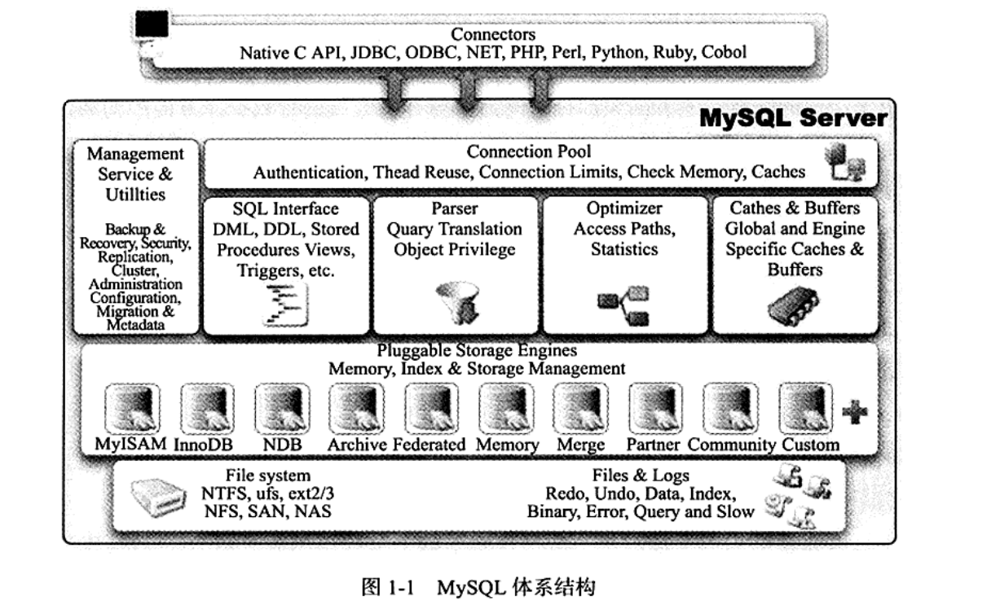
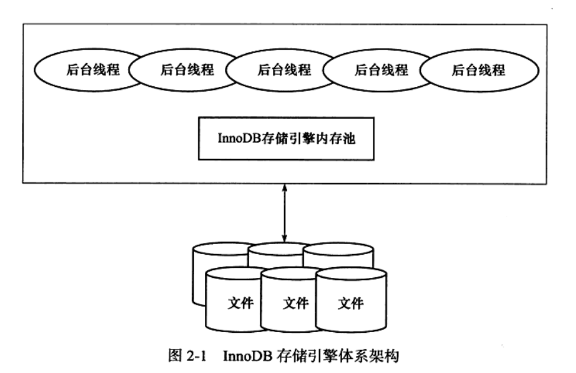
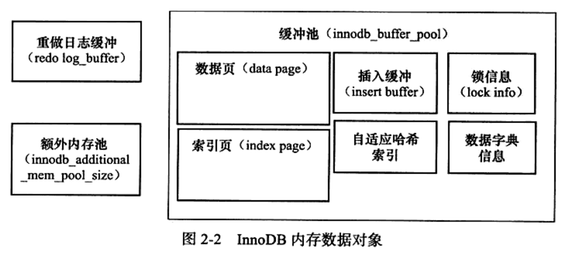

# MySQL技术内幕 LnnoDB存储引擎 读书笔记

## 1 MySQL 体系结构和存储引擎

### 1.1 数据库和数据库实例

1. 数据库：物理操作系统文件活其他形式文件类型的集合

​		实例：MySQL数据库是由后台线程以及一个共享内存区组成

​		通常两者是一一对应。

​		MySQL数据库实例在系统上的表现就是一个进程

2. `ps -ef | grep mysqld`查看mysql数据库启动后的进程情况

3. 在 MySQL 数据库中，可以没有配置文件， 在这种情况下， MySQL 会按照编泽时的默认参数设置启动实例。 用以下命令可以査看当 MySQL 数据库实例启动时， 会在哪些位置査找配置文件。  

   ```
   [root@xen-server bin 】 # mysql --help | grep my.cnf
   order of preference, my.cnf, SQL_TCP_PORT,
   /etc/my.cnf /etc/mysql/my.cnf /usr/local/mysql/etc/my.cnf ~/.my.cnf
   ```

   MySQL 数据库会以读取到的最后一个配置文件中的参数为准。 在 Linux 环境下， 配置文件一般放在/etc/my.cnf 下。   

4. 配置文件中有一个参数 datadir, 该参数指定了数据库所在的路径。 在 Linux 操作系统下默认 datadir 为 /usr/local/mysql/data, .

   ```
   mysql>SHOW VARIABLES LIKE • datadir,\G; #可以查看该变量
   ```

### 1.2 MySQL体系结构

从概念上来说， 数据库是文件的集合依照某种数据模型组织起来并存放于二级存储器中的数据集合 ； 数据库实例是程序是位于用户与操作系统之间的一层数据管理软件，用户对数据库数据的任何操作，包括数据
库定义、 数据査询、 数据维护、 数据库运行控制等都是在数据库实例下进行的， 应用程序只有通过数据库实例才能和数据库打交道。



 可以发现， MySQL 由以下几部分组成：
□ 连接池组件
□ 管理服务和工具组件
□ SQL 接口组件
□ 査询分析器组件
□ 优化器组件
□ 缓冲 (Cache) 组件
□ 插件式存储引擎
□ 物理文件  

需要特别注意的是， 存储引擎是基于表的， 而不是数据库。  

### 1.3 MySQL存储引擎  

由于 MySQL 数据库的开源特性， 用户可以根据 MySQL 预定义的存储引擎接口编写自己的存储引擎。   

由于 MySQL 数据库开源特性， 存储引擎可以分为 MySQL 官方存储引擎和第三方存储引擎。 有些第三方存储引擎很强大， 如大名鼎鼎的 InnoDB 存储引擎（ 最早是第三方存储引擎， 后被 Oracle 收购），  

#### 1.3.1 InnoDB 存储引擎  

​	InnoDB 存储引擎支持事务， 其设计目标主要面向在线事务处理（OLTP) 的应用。其特点是行锁设计、 支持外键， 并支持类似于 Oracle 的非锁定读， 即默认读取操作不会产生锁。 从 MySQL 数据库 5.5.8 版本开始， InnoDB 存储引擎是默认的存储引擎。
​	InnoDB 存储引擎将数据放在一个逻辑的表空间中， 这个表空间就像黑盒一样由InnoDB 存储引擎自身进行管理。 从 MySQL 4.1 (包括 4.1 ) 版本开始， 它可以将每个InnoDB 存储引擎的表单独存放到一个独立的 ibd 文件中。 此外， InnoDB 存储引擎支持用裸设备（ rowdisk) 用来建立其表空间。
​	InnoDB 通过使用多版本并发控制（ MVCC) 来获得高并发性， 并且实现了 SQL标准的 4 种隔离级别， 默认为 REPEATABLE 级别。 同时， 使用一种被称为 next-keylocking 的策略来避免幻读（ phantom ) 现象的产生。 除此之外， InnoDB 储存引擎还提供了插人缓冲（ insert buffer)、 二次写（ double write)、 自适应哈希索引（ adaptive hash index)、 预读（ read ahead ) 等高性能和高可用的功能。
​	对于表中数据的存储， InnoDB 存储引擎采用了聚集（ clustered) 的方式， 因此每张表的存储都是按主键的顺序进行存放。 如果没有显式地在表定义时指定主键， InnoDB 存储引擎会为每一行生成一个 6 字节的 ROWID, 并以此作为主键。  

#### 1.3.2 MylSAM 存储引擎  

​	MylSAM 存储引擎不支持事务、 表锁设计， 支持全文索引， 主要面向一些 OLAP数据库应用。 在 MySQL 5.5.8 版本之前 MylSAM 存储引擎是默认的存储引擎（ 除Windows 版本外）。 数据库系统与文件系统很大的一个不同之处在于对事务的支持， 然而 MylSAM 存储引擎是不支持事务的。 究其根本， 这也不是很难理解。 试想用户是否在所有的应用中都需要事务呢？ 在数据仓库中， 如果没有 ETL 这些操作， 只是简单的报表査询是否还需要事务的支持呢？ 

此外， MylSAM 存储引擎的另一个与众不同的地方是==它的缓冲池只缓存 (cache) 索引文件==， 而不缓冲数据文件， 这点和大多数的数据库都非常
不同。
	MylSAM 存储引擎表由 MYD 和 MYI 组成， MYD 用来存放数据文件， MYI 用来存放索引文件。 可以通过使用 myisampack 工具来进一步压缩数据文件， 因为 myisampack工具使用赫夫曼（ Huffman) 编码静态算法来压缩数据， 因此使用 myisampack 工具压缩后的表是只读的， 当然用户也可以通过 myisampack 来解压数据文件。
	在 MySQL 5.0 版本之前， MylSAM 默认支持的表大小为 4GB, 如果需要支持大于 4GB 的 MylSAM 表时， 则需要制定 MAX_ROWS 和 AVG_ROW_LENGTH 属性。 从MySQL 5.0 版本开始， MylSAM 默认支持 256TB 的单表数据， 这足够满足一般应用需求。  

#### 1.3.3 NDB 存储引擎  

NDB NDB 存储引擎是一个集群存储引擎 。NDB 的特点是数据全部放在内存中 （MySQL5.1后，非索引数据放在磁盘），因此通过主键查找极快。

NDB 存储引擎的连接操作(JOIN) 是在 MySQL 数据库层完成的， 而不是在存储引擎层完成的。 这意味着， 复杂的连接操作需要巨大的网络开销， 因此査询速度很慢。   

#### 1.3.4 Memory 存储引擎  

Memory 存储引擎（ 之前称 HEAP 存储引擎） 将表中的数据存放在内存中， 如果数据库重启或发生崩溃， 表中的数据都将消失。 它非常适合用于存储临时数据的临时表，以及数据仓库中的纬度表。 Memory 存储引擎默认使用哈希索引， 而不是我们熟悉的 B十树索引。

  虽然 Memory 存储引擎速度非常快， 但在使用上还是有一定的限制。 比如， 只支持表锁， 并发性能较差， 并且不支持 TEXT 和 BLOB 列类型。 最重要的是， 存储变长字段(varchar) 时是按照定常字段（char) 的方式进行的， 因此会浪费内存（这个问题之前已经提到， eBay 的工程师 Igor Chernyshev 已经给出了 patch 解决方案）。

​	此外有一点容易被忽视， MySQL 数据库使用 Memory 存储引擎作为临时表来存放査询的中间结果集（ intermediate result)。 如果中间结果集大于 Memory 存储引擎表的容量设置， 又或者中间结果含有 TEXT 或 BLOB 列类型字段， 则 MySQL 数据库会把其转换到 MylSAM 存储引擎表而存放到磁盘中。 之前提到 MylSAM 不缓存数据文件， 因此这时产生的临时表的性能对于査询会有损失。  

。。。

### 1.4 各存储引擎之间的比较  

MySQL 的官方手册， 展现了 一些常用 MySQL 存储引擎之间的不同之处， 包括存储容量的限制、 事务支持、 锁的粒度、 MVCC 支持、 支持的索引、 备份和复制等。

SHOW ENGINES 语句査看当前使用的 MySQL 数据库所支持的存储引擎  

### 1.5 连接 MySQL  

连接 MySQL 操作是一个连接进程和 MySQL 数据库实例进行通信 。本质上是进程通信。  

#### 1.5.1 TCP/IP  

这种方式在 TCP/IP 连接上建立一个基于网络的连接请求， 一
般情况下客户端（ client) 在一台服务器上， 而 MySQL 实例（ server) 在另一台服务器上， 这两台机器通过一个 TCP/IP 网络连接。 例如用户可以在 Windows 服务器下请求一台远程 Linux 服务器下的 MySQL 实例， 如下所示：

```
C:\>mysql -h192.168.0.101 -u root -P
```

在通过 TCP/IP 连接到 MySQL 实例时， MySQL 数据库会先检
查一张权限视图， 用来判断发起请求的客户端 IP 是否允许连接到 MySQL 实例。 该视图在 mysql 架构下， 表名为 user， 如下所示  

```
mysql>USE mysql;
Database changed
mysql>SELECT host,user,password FROM user;
***1 .row***
host: 192.168.24.%
user: root
password: *75DBD4FA548120B54FE693006C41AA9A16DE8FBE
*** 2• row***
host: nineyouO-43
user: root
password: *75DBD4FA548120B54FE693006C41AA9A16DE8FBE
*** 3.row* * 
host: 127•0.0.1
user: root
password: *75DBD4FA548120B54FE693006C41AA9A16DE8FBE
*** 4.row ***
host: 192.168.0.100
user: z l m
password: *DAE0939275CC7CD8E0293812A31735DA9CF0953C
* * 5 • row* * 
host: %
user: david
password:
5 rows in set (0.00 sec)
```

从这张权限表中可以看到， MySQL 允许 david 这个用户在任何 IP 段下连接该实例，并且不需要密码。 此外， 还给出了 root 用户在各个网段下的访问控制权限。  

#### 1.5.2 命名管道和共享内存  

在 MySQL 数据库中须在配置文件中启用-enable-named-pipe 选项。   

在 MySQL 4.1 之后的版本中， MySQL 还提供了共享内存的连接方式， 这是通过在配置文件中添加-shared-memory 实现的。 如果想使用共享内存的方式， 在连接时， MySQL 客户端还必须使用-protocol=memory 选项。

#### 1.5.3 UNIX 域套接字

在 Linux 和 UNIX 环境下， 还可以使用 UNIX 域套接字。 UNIX 域套接字其实不是一个网络协议， 所以==只能在 MySQL 客户端和数据库实例在一台服务器上的情况下使用==。
用户可以在配置文件中指定套接字文件的路径， 如`--sockeh=/tmp/mysql.sock` 。 当数据库实例启动后， 用户可以通过下列命令来进行 UNIX 域套接字文件的査找  :

```
mysql>SHOW VARIABLES LIKE 1socket 1;
Variable_name: socket
	Value: /tmp/mysql.sock
1 row in set (0.00 sec)
```

在知道了 UNIX 域套接字文件的路径后， 就可以使用该方式进行连接了， 如下所示:

```
[root@stargazer~] # mysql -udavid -S /tmp/mysql.sock
Welcome to the MySQL monitor. Commands end with ; or \g.
Your MySQL connection id is 20333
Server version: 5.0.77-log MySQL Community Server (GPL)

Type 'help' or '\h' for help.Type 1 '\c' to clear the buffer.

mysql>  
```

## 2 InnoDB 存储引擎  

### 2.1 InnoDB 存储引擎概述  

第一个完整支持 ACID 事务的 MySQL 存储引擎  。

### 2.2 InnoDB 存储引擎的版本  

InnoDB 各版本功能对比  

| 版 本         | 功 能                                                        |
| ------------- | ------------------------------------------------------------ |
| 老版本 InnoDB | 支持 ACID、 行锁设计、 MVCC                                  |
| InnoDB 1.0.x  | 继承了上述版本所有功能， 增加了 compress 和 dynamic 页格式 。 |
| InnoDB 1.1.x  | 继承了上述版本所有功能， 增加了 Linux AIO、 多回滚段         |
| InnoDB 1.2.x  | 继承了上述版本所有功能， 增加了全文索引支持、 在线索引添加   |

### 2.3 InnoDB 体系架构  

图 2-1 简单显示了 IrnioDB 的存储引擎的体系架构， 从图可见， IrnioDB 存储引擎有多个内存块， 可以认为这些内存块组成了一个大的内存池， 负责如下工作：

*  维护所有进程 / 线程需要访问的多个内部数据结构。
* 缓存磁盘上的数据， 方便快速地读取， 同时在对磁盘文件的数据修改之前在这里缓存。
* 重做日志 Credo log) 缓冲。  



后台线程的主要作用是负责刷新内存池中的数据， 保证缓冲池中的内存缓存的是最近的数据。 此外将已修改的数据文件刷新到磁盘文件， 同时保证在数据库发生异常的情况下 InnoDB 能恢复到正常运行状态。  

### 2.3.1 后台线程  

InnoDB 存储引擎是多线程的模型， 因此其后台有多个不同的后台线程， 负责处理不同的任务。

1. Master Thread
   Master Thread 是一个非常核心的后台线程， 主要负责将缓冲池中的数据==异步==刷新到磁盘， 保证数据的一致性， 包括脏页的刷新、 合并插人缓冲（ INSERT BUFFER)、UNDO 页的回收等。 2.5 节会详细地介绍各个版本中 Master Thread 的工作方式。  

2. IO Thread
   在 IrmoDB 存储引擎中大量使用了 AIO ( Async 10) 来处理写 IO 请求， 这样可以极大提高数据库的性能。 而 IO Thread 的工作主要是负责这些==IO 请求的回调 (call back )处理==。InnoDB 1.0 版本之前共有 4 个 IO Thread, 分别是 write、 read、 insert buffer 和 log
   IO thread。 ==在 Linux 平台下， IO Thread 的数量不能进行调整==， 但是在 Windows 平台下可以通过参数innodb_file_io_threads 来增大 IO Thread。 从 InnoDB 1.0.x 版本开始， read thread 和 write thread 分别增大到了 4 个， 并且不再使用innodb_file_io_threads 参数， 而是分别使用innodb_read_io_threads 和 innodb_write_io_threads 参数进行设置 。

   可以通过命令 SHOW ENGINE INNODB STATUS 来观察 InnoDB 中的 IO Thread。

3. Purge Thread
   事务被提交后， 其所使用的 undolog 可能不再需要， 因此需要 PurgeThread 来回收已经使用并分配的 undo 页。 在 InnoDB 1.1 版本之前， purge 操作仅在 InnoDB 存储引擎的 Master Thread 中完成。 而从 InnoDB 1.1 版本开始， purge 操作可以独立到单独的线
   程中进行， 以此来减轻 Master Thread 的工作， 从而提髙 CPU 的使用率以及提升存储引擎的性能。 用户可以在 MySQL 数据库的配置文件中添加如下命令来启用独立的 Purge Thread： 

   ```
   [mysqld)
   innodb_purge_threads=1
   ```

    在 InnoDB 1.1 版本中， 即使将 innodb_purge_threads 设为大于 1 , InnoDB 存储引擎
   启动时也会将其设为 1, 并在错误文件中出现如下类似的提示：

   ```
   120529 22:54:16 [Warning] option 1innodb-purge-threads * : unsigned value 4 adjusted to 1  
   ```

   从 InnoDB 1.2 版本开始， InnoDB 支持多个 Purge Thread  ,加快 页的回收  

4. Page Cleaner Thread
   Page Cleaner Thread 是在 InnoDB 1.2.x 版本中引入的。 其作用是将之前版本中脏页的刷新操作都放人到单独的线程中来完成。 而其目的是为了减轻原 Master Thread 的工作及对于用户査询线程的阻塞， 进一步提髙 InnoDB 存储引擎的性能  

### 2.3.2 内存  

#### 1. 缓冲池

​	InnoDB 存储引擎是基于磁盘存储的， 并将其中的记录按照页的方式进行管理。 因此可将其视为基于磁盘的数据库系统 (Disk-base Database)„ 在数据库系统中， 由于 CPU速度与磁盘速度之间的鸿沟， 基于磁盘的数据库系统通常使用缓冲池技术来提高数据库的整体性能。

​	缓冲池简单来说就是一块内存区域， 通过内存的速度来弥补磁盘速度较慢对数据库性能的影响。 在数据库中进行读取页的操作， 首先将从磁盘读到的页存放在缓冲池中，这个过程称为将页 “FIX” 在缓冲池中。 下一次再读相同的页时， 首先判断该页是否在缓冲池中。 若在缓冲池中， 称该页在缓冲池中被命中， 直接读取该页。 否则， 读取磁盘上的页。

​	对于数据库中页的修改操作， 则首先修改在缓冲池中的页， 然后再以一定的频率刷新到磁盘上。 这里需要注意的是， 页从缓冲池刷新回磁盘的操作并不是在每次页发生更新时触发， 而是通过一种称为 Checkpoint 的机制刷新回磁盘。 同样， 这也提高了数据库的整体性能。  

​	综上所述， 缓冲池的大小直接影响着数据库的整体性能。 由于 32 位操作系统的限制， 在该系统下最多将该值设置为 3G。 此外用户可以打开操作系统的 PAE 选项来获得32 位操作系统下最大 64GB 内存的支持。 随着内存技术的不断成熟， 其成本也在不断下降。 单条 8GB 的内存变得非常普遍， 而 PC 服务器已经能支持 512GB 的内存。 因此为了让数据库使用更多的内存， 强烈建议数据库服务器都采用 64 位的操作系统。  

对于 InnoDB 存储引擎而言， 其缓冲池的配置通过参数 `innodb_buffer_pool_size` 来设置。 下面显示一台 MySQL 数据库服务器， 其将 IrnioDB 存储引擎的缓冲池设置为15GB。

[MySQL系统变量（查看和修改)]: http://c.biancheng.net/view/8125.html

```
mysql> SHOW VARIABLES LIKE 'innodb_buffer_pool_size'\G;
*************************** 1. row ***************************
Variable_name: innodb_buffer_pool_size
        Value: 134217728
1 row in set (0.01 sec)
```

体来看， 缓冲池中缓存的数据页类型有 ： 索引页、 数据页、 undo 页、 插入缓冲( insert buffer)、 自适应哈希索引（ adaptive hash index )、 InnoDB 存储的锁信息（ lock info)、 数据字典信息（ data dictionary) 等。 不能简单地认为， 缓冲池只是缓存索引页和数据页， 它们只是占缓冲池很大的一部分而已 。



从 InnoDB 1.0.x 版本开始， 允许有多个缓冲池实例。 每个页根据哈希值平均分配到不同缓冲池实例中。 这样做的好处是减少数据库内部的资源竞争， 增加数据库的并发处理能力。 可以通过参数innodb_buffer_pool_instances 来进行配置， 该值默认1.

```
mysql> SHOW VARIABLES LIKE 'innodb_buffer_pool_instances' \G;
*************************** 1. row ***************************
Variable_name: innodb_buffer_pool_instances
        Value: 1
1 row in set (0.00 sec)
```

在配置文件中将 innodb_buffer_pool_instances 设置为大于 1 的值就可以得到多个缓冲池实例。 再通过命令 SHOW ENGINE INNODB STATUS 可以观察到如下的内容(观察到每个缓冲池实例对象运行
的状态， 并且通过类似 …BUFFER POOL 0 的注释来表明是哪个缓冲池实例。  )

```
mysql> SHOW ENGINE INNODB STATUS\G;
*************************** 1. row ***************************
  Type: InnoDB
  Name: 
Status: 
=====================================
2022-04-07 13:34:58 139852799502080 INNODB MONITOR OUTPUT
=====================================
Per second averages calculated from the last 7 seconds
-----------------
BACKGROUND THREAD
-----------------
srv_master_thread loops: 9 srv_active, 0 srv_shutdown, 1378 srv_idle
srv_master_thread log flush and writes: 0
----------
SEMAPHORES
----------
OS WAIT ARRAY INFO: reservation count 203
OS WAIT ARRAY INFO: signal count 150
RW-shared spins 0, rounds 0, OS waits 0
RW-excl spins 0, rounds 0, OS waits 0
RW-sx spins 0, rounds 0, OS waits 0
Spin rounds per wait: 0.00 RW-shared, 0.00 RW-excl, 0.00 RW-sx
------------
TRANSACTIONS
------------
Trx id counter 2328
Purge done for trx's n:o < 2328 undo n:o < 0 state: running but idle
History list length 0
LIST OF TRANSACTIONS FOR EACH SESSION:
---TRANSACTION 421328386567384, not started
0 lock struct(s), heap size 1128, 0 row lock(s)
---TRANSACTION 421328386566576, not started
0 lock struct(s), heap size 1128, 0 row lock(s)
---TRANSACTION 421328386565768, not started
0 lock struct(s), heap size 1128, 0 row lock(s)
--------
FILE I/O
--------
I/O thread 0 state: waiting for completed aio requests (insert buffer thread)
I/O thread 1 state: waiting for completed aio requests (log thread)
I/O thread 2 state: waiting for completed aio requests (read thread)
I/O thread 3 state: waiting for completed aio requests (read thread)
I/O thread 4 state: waiting for completed aio requests (read thread)
I/O thread 5 state: waiting for completed aio requests (read thread)
I/O thread 6 state: waiting for completed aio requests (write thread)
I/O thread 7 state: waiting for completed aio requests (write thread)
I/O thread 8 state: waiting for completed aio requests (write thread)
I/O thread 9 state: waiting for completed aio requests (write thread)
Pending normal aio reads: [0, 0, 0, 0] , aio writes: [0, 0, 0, 0] ,
 ibuf aio reads:, log i/o's:, sync i/o's:
Pending flushes (fsync) log: 0; buffer pool: 0
853 OS file reads, 351 OS file writes, 140 OS fsyncs
0.00 reads/s, 0 avg bytes/read, 0.00 writes/s, 0.00 fsyncs/s
-------------------------------------
INSERT BUFFER AND ADAPTIVE HASH INDEX
-------------------------------------
Ibuf: size 1, free list len 0, seg size 2, 0 merges
merged operations:
 insert 0, delete mark 0, delete 0
discarded operations:
 insert 0, delete mark 0, delete 0
Hash table size 34679, node heap has 0 buffer(s)
Hash table size 34679, node heap has 0 buffer(s)
Hash table size 34679, node heap has 0 buffer(s)
Hash table size 34679, node heap has 0 buffer(s)
Hash table size 34679, node heap has 0 buffer(s)
Hash table size 34679, node heap has 0 buffer(s)
Hash table size 34679, node heap has 1 buffer(s)
Hash table size 34679, node heap has 4 buffer(s)
0.00 hash searches/s, 0.00 non-hash searches/s
---
LOG
---
Log sequence number          18273233
Log buffer assigned up to    18273233
Log buffer completed up to   18273233
Log written up to            18273233
Log flushed up to            18273233
Added dirty pages up to      18273233
Pages flushed up to          18273233
Last checkpoint at           18273233
64 log i/o's done, 0.00 log i/o's/second
----------------------
BUFFER POOL AND MEMORY
----------------------
Total large memory allocated 0
Dictionary memory allocated 404995
Buffer pool size   8192
Free buffers       7210
Database pages     977
Old database pages 380
Modified db pages  0
Pending reads      0
Pending writes: LRU 0, flush list 0, single page 0
Pages made young 0, not young 0
0.00 youngs/s, 0.00 non-youngs/s
Pages read 830, created 147, written 223
0.00 reads/s, 0.00 creates/s, 0.00 writes/s
No buffer pool page gets since the last printout
Pages read ahead 0.00/s, evicted without access 0.00/s, Random read ahead 0.00/s
LRU len: 977, unzip_LRU len: 0
I/O sum[0]:cur[0], unzip sum[0]:cur[0]
--------------
ROW OPERATIONS
--------------
0 queries inside InnoDB, 0 queries in queue
0 read views open inside InnoDB
Process ID=81082, Main thread ID=139852850915072 , state=sleeping
Number of rows inserted 0, updated 0, deleted 0, read 0
0.00 inserts/s, 0.00 updates/s, 0.00 deletes/s, 0.00 reads/s
Number of system rows inserted 35, updated 319, deleted 34, read 5448
0.00 inserts/s, 0.00 updates/s, 0.00 deletes/s, 0.00 reads/s
----------------------------
END OF INNODB MONITOR OUTPUT
============================

1 row in set (0.00 sec)

ERROR: 
No query specified

```

从 MySQL 5.6 版本开始， 还可以通过 information_schema 架构下的表 INNODB_BUFFER_POOL_STATS 来观察缓冲的状态， 如运行下列命令可以看到各个缓冲池的使
用状态：

```
mysql> use information_schema
Reading table information for completion of table and column names
You can turn off this feature to get a quicker startup with -A

Database changed
mysql> SELECT POOL_ID,POOL_SIZE, FREE_BUFFERS,DATABASE_PAGES FROM INNODB_BUFFER_POOL_STATS\G;
*************************** 1. row ***************************
       POOL_ID: 0
     POOL_SIZE: 8192
  FREE_BUFFERS: 7180
DATABASE_PAGES: 1006
1 row in set (0.00 sec)

```

#### 2.LRU List、 Free List 和 Flush List  

InnoDB 存储引擎是怎么对这么大的内存区域进行管理的呢  

通常来说， 数据库中的缓冲池是通过 LRU ( Latest Recent Used, 最近最少使用〉 算法来进行管理的。   

在 InnoDB 存储引擎中， 缓冲池中页的大小默认为 16KB, 同样使用 LRU 算法对缓冲池进行管理 。 稍有不同的是InnoDB对传统的LRU算法做了一些优化。在InnoBD的存储引擎中，LRU列表还加入midpoint位置。新读取到的页，不直接放到首部，而是放到midpoint的位置。该算法称为midpoint insertion startegy。默认配置下，位置在LRU列表长度的5/8处。

mid位置由参数innodb_old_blocks_pct控制。

```
mysql> SHOW VARIABLES LIKE 'innodb_old_blocks_pct'\G;
*************************** 1. row ***************************
Variable_name: innodb_old_blocks_pct
        Value: 37
1 row in set (0.01 sec)
```

那为什么不采用朴素的 LRU 算法， 直接将读取的页放入到 LRU 列表的首部呢？ 这是因为若直接将读取到的页放入到 LRU 的首部， 那么某些 SQL 操作可能会使缓冲池中的页被刷新出， 从而影响缓冲池的效率。 常见的这类操作为索引或数据的扫描操作。 这类操作需要访问表中的许多页， 甚至是全部的页， 而这些页通常来说又仅在这次査询操作中需要， 并不是活跃的热点数据。 如果页被放人 LRU 列表的首部， 那么非常可能将所需要的热点数据页从 LRU 列表中移除， 而在下一次需要读取该页时， InnoDB 存储引擎需要再次访问磁盘 。

为了解决这个问题， IimoDB 存储引擎引人了另一个参数来进一步管理 LRU 列表，这个参数是 innodb_old_blocks_time, 用于表示页读取到 mid 位置后需要等待多久才会被加入到 LRU 列表的热端。 因此当需要执行上述所说的 SQL 操作时， 可以通过下面的方法尽可能使 LRU 列表中热点数据不被刷出  

如果用户预估自己活跃的热点数据不止 63%, 那么在执行 SQL 语句前， 还可以通过下面的语句来减少热点页可能被刷出的概率。  

```
mysql> SET GLOBAL innodb_old_blocks_pct=20;
Query OK, 0 rows affected (0.00 sec)
```

LRU 列表用来管理已经读取的页， 但当数据库刚启动时， LRU 列表是空的， 即没有任何的页。 这时页都存放在 Free 列表中。 当需要从缓冲池中分页时， 首先从 Free 列表中査找是否有可用的空闲页， 若有则将该页从 Free 列表中删除， 放人到 LRU 列表中。否则， 根据 LRU 算法， 淘汰 LRU 列表末尾的页， 将该内存空间分配给新的页。 当页从LRU 列表的 old 部分加人到 new 部分时， 称此时发生的操作为 page made young, 而因为 innodb_old_blocks_time 的设置而导致页没有从 old 部分移动到 new 部分的操作称为==page not made young==。 可以通过命令 SHOW ENGINE INNODB STATUS 来观察 LRU 列表及 Free 列表的使用情况和运行状态 。

